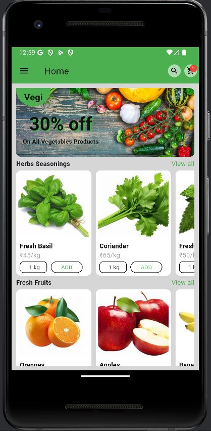
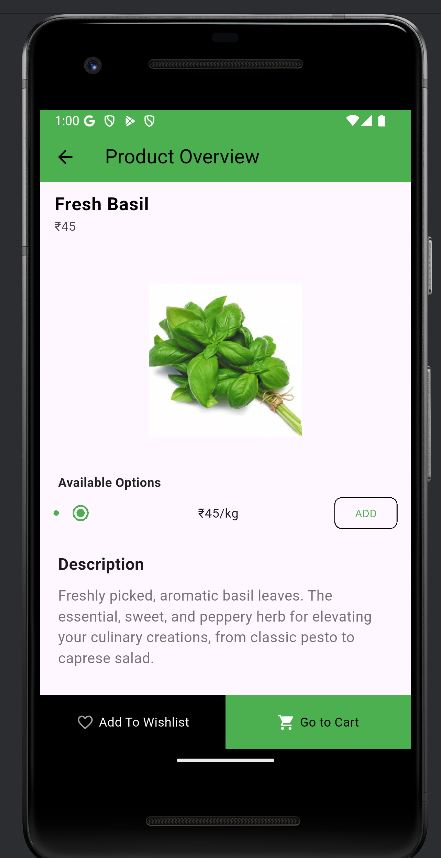
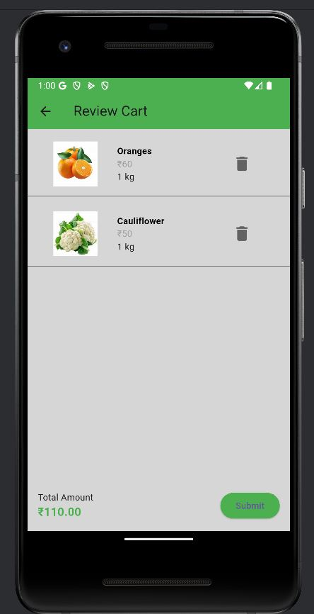
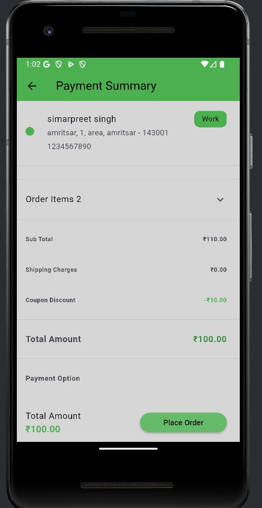
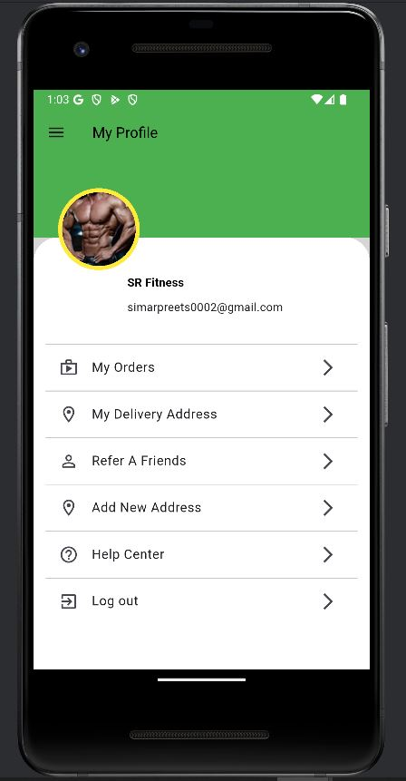
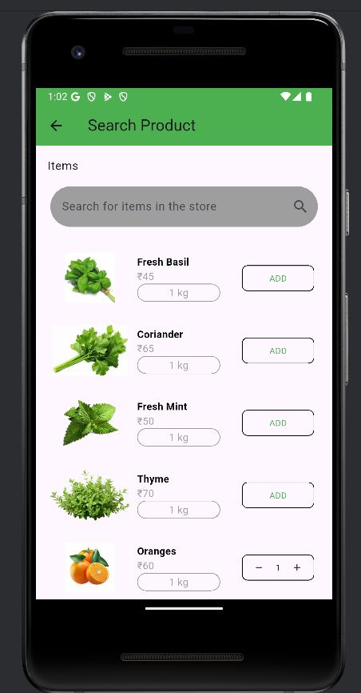

# Vegi App - Flutter E-Commerce Application

## Demo Video
Watch the app in action:

<video src="assets/demo.mp4" controls width="600"></video>


## Features
🔐 Firebase Authentication - Sign in with Google or Apple ID

🛍️ Product Catalog - Browse various grocery products

🔍 Search Functionality - Find products quickly

🛒 Shopping Cart - Add/remove items with quantity control

❤️ Wishlist - Save favorite products for later

💳 Razorpay Integration - Secure payment processing

👤 User Profile - Manage personal information and addresses

📱 Responsive Design - Optimized for both iOS and Android

## Screenshots
| Splash Screen | Sign In                                     | Home Screen                                   |
|--|---------------------------------------------|-----------------------------------------------|
|   |  |  |

| Product Details                                              | Shopping Cart                                         | Payment                                      |
|--------------------------------------------------------------|-------------------------------------------------------|----------------------------------------------|
|  |  |  |

| Profile Drawer                                      | Drawer                   | Search                                     |
|-----------------------------------------------------|--------------------------|--------------------------------------------|
|  |  |  
## Tech Stack

**Framework:** Flutter

**Backend:** Firebase (Authentication, Firestore)

**Payment:** Razorpay SDK

**State Management:** Provider

**Navigation:** Flutter Navigator 2.0

## Installation
1. Clone the repository
   ```bash
   git clone https://github.com/simarpreetsingh1/vegitable-e-commerce-app.git
   cd vegitable-e-commerce-app
Install dependencies

bash
flutter pub get
Setup Firebase

Create a new Firebase project

Enable Authentication (Google & Apple sign-in)

Set up Firestore database

Add Android and iOS apps to your project

Download google-services.json and GoogleService-Info.plist files

Place them in android/app/ and ios/Runner/ respectively

Configure Razorpay

Create a Razorpay account

Obtain API keys

Update keys in lib/config/razorpay_config.dart

Run the application

bash
flutter run
Payment Integration
The app uses Razorpay for processing payments. The integration includes:

Order creation

Payment collection

Payment verification

Order confirmation

Contributing
Fork the project

Create your feature branch (git checkout -b feature/AmazingFeature)

Commit your changes (git commit -m 'Add some AmazingFeature')

Push to the branch (git push origin feature/AmazingFeature)

Open a Pull Request

License
This project is licensed under the MIT License - see the LICENSE file for details.

Acknowledgments
Flutter team for the amazing framework

Firebase for backend services

Razorpay for payment gateway

Support
If you have any questions or issues, please create an issue in the GitHub repository or contact us.