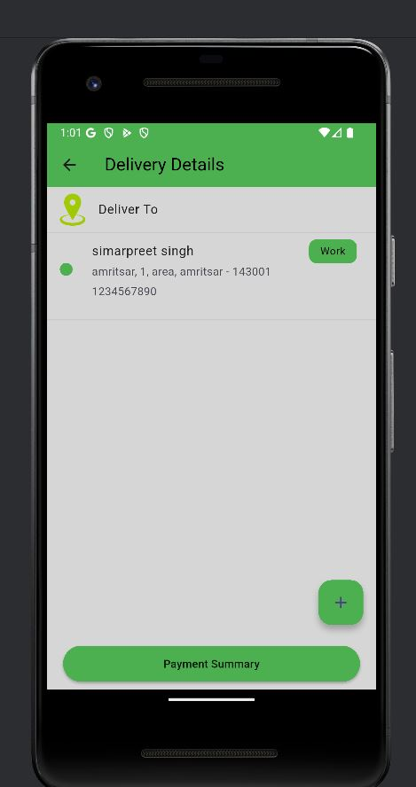

# Vegi App - Flutter E-Commerce Application

## Features
🔐 Firebase Authentication - Sign in with Google or Apple ID

🛍️ Product Catalog - Browse various grocery products

🔍 Search Functionality - Find products quickly

🛒 Shopping Cart - Add/remove items with quantity control

❤️ Wishlist - Save favorite products for later

💳 Razorpay Integration - Secure payment processing

👤 User Profile - Manage personal information and addresses

📱 Responsive Design - Optimized for both iOS and Android

## Screenshots
| Sign In                                     | Home Screen                                   | Address Screen                                      |
|---------------------------------------------|-----------------------------------------------|-----------------------------------------------------|
|  |  |  |

| Product Details                                              | Shopping Cart                                         | Payment                                      |
|--------------------------------------------------------------|-------------------------------------------------------|----------------------------------------------|
|  |  |  |

| Profile Drawer                                      | Drawer                   | Search                                     |
|-----------------------------------------------------|--------------------------|--------------------------------------------|
|  |  |  
## Tech Stack

**Framework:** Flutter

**Backend:** Firebase (Authentication, Firestore)

**Payment:** Razorpay SDK

**State Management:** Provider

**Navigation:** Flutter Navigator 2.0
🚀 Installation & Setup
Prerequisites
Flutter SDK (version 3.0.0 or higher)

Dart SDK (version 2.17.0 or higher)

Android Studio/Xcode (for emulator/simulator)

Firebase account

Razorpay account

Step-by-Step Installation
1. Clone the Repository
   bash
   git clone https://github.com/simarpreetsingh1/vegitable-e-commerce-app.git
   cd vegitable-e-commerce-app
2. Install Dependencies
   bash
   flutter pub get
3. Firebase Configuration
   Firebase Project Setup:

Create a new Firebase project at Firebase Console

Enable Authentication providers:

Google Sign-In

Apple Sign-In (for iOS)

Set up Firestore Database with appropriate security rules

Add your applications to the project:

Android app (package name: com.yourapp.vegi)

iOS app (bundle ID: com.yourapp.vegi)

File Placement:

Download google-services.json and place in android/app/

Download GoogleService-Info.plist and place in ios/Runner/

4. Razorpay Integration
   Account Setup:

Create a Razorpay account at Razorpay Dashboard

Obtain your API keys:

Key ID (public key)

Key Secret (private key - keep secure)

Configuration:
Update the Razorpay keys in lib/config/razorpay_config.dart:

dart
const String razorpayKeyId = 'your_public_key_here';
const String razorpayKeySecret = 'your_private_key_here';
5. Run the Application
   bash
# For Android
flutter run -d android

# For iOS
flutter run -d ios

# For specific device
flutter run -d device_id
💳 Payment Integration
The application integrates Razorpay for seamless payment processing with the following features:

Payment Flow
Order Creation - Generate unique orders with amount verification

Payment Collection - Secure card/UPI/wallet transactions

Payment Verification - Server-side validation for security

Order Confirmation - Update order status upon successful payment

Supported Payment Methods
Credit/Debit Cards

UPI Applications

Net Banking

Wallets (Paytm, PhonePe, etc.)

EMI Options

🤝 Contributing
We welcome contributions! Please follow these steps:

Contribution Workflow
Fork the project repository

Create a feature branch:

bash
git checkout -b feature/YourFeatureName
Commit your changes with descriptive messages:

bash
git commit -m "feat: add new payment validation feature"
Push to your branch:

bash
git push origin feature/YourFeatureName
Open a Pull Request with detailed description

Commit Message Guidelines
Use present tense ("add feature" not "added feature")

Use imperative mood ("move cursor to..." not "moves cursor to...")

Limit the first line to 72 characters or less

Reference issues and pull requests liberally

📄 License
This project is licensed under the MIT License - see the LICENSE file for complete details.

Permissions
Commercial use

Modification

Distribution

Private use

Limitations
Liability

Warranty

🙏 Acknowledgments
Core Technologies
Flutter Team - For the comprehensive and powerful cross-platform framework

Firebase - For robust backend services and real-time database solutions

Razorpay - For secure and reliable payment gateway integration

Contributors
Thanks to all our contributors who have helped shape this project

Special recognition to early adopters and beta testers

🆘 Support
Getting Help
📝 Create an Issue - For bug reports and feature requests

💬 Discussion Board - For questions and community support

📧 Contact Maintainers - For critical issues requiring immediate attention

Resources
Documentation Wiki

FAQ Section

Troubleshooting Guide

Response Time
Critical issues: Within 24 hours

Feature requests: Within 3-5 business days

General questions: Within 2-3 business days